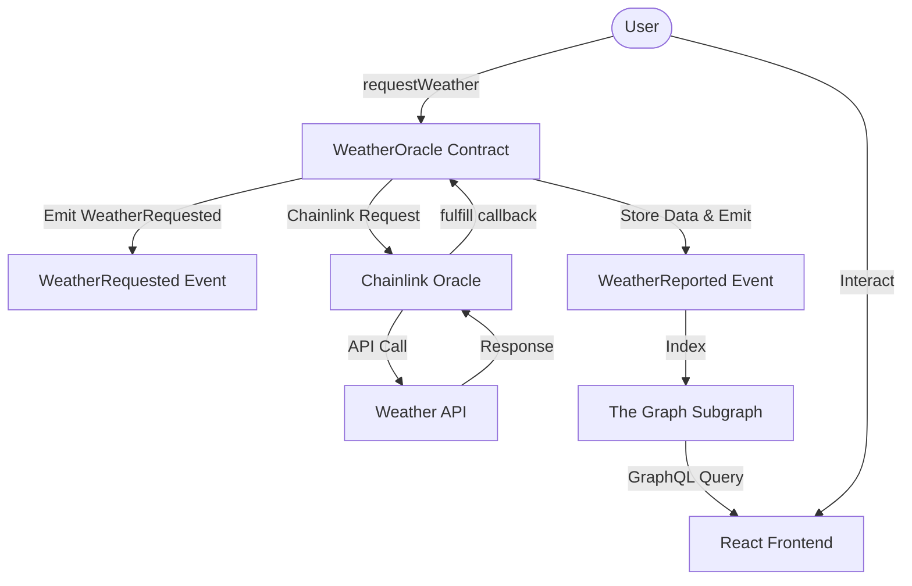

# Architecture Design Document

## Decentralized Weather Oracle System

### Design Decisions

#### 1. Chainlink Any API Integration
We chose the Chainlink Any API pattern to allow for maximum flexibility in fetching weather data from public APIs like OpenWeatherMap. This enables the dApp to access real-world data securely.

#### 2. Event-Driven Indexing
Instead of storing all historical data on the blockchain (which is expensive), we use an event-driven design. The `WeatherReported` event captures all necessary data points. The Graph Protocol then indexes these events off-chain, providing a high-performance GraphQL API for the frontend.

#### 3. On-Chain Parsing
The `WeatherOracle` contract includes logic to parse comma-separated strings returned by the Chainlink Oracle. This reduces the number of oracle requests needed for multiple data points (temperature and description).

#### 4. Subgraph Idempotency
The subgraph mappings use the `requestId` as the entity ID. This ensures that even if an event is processed multiple times, it will only result in a single, consistent record in the database.

### Data Flow Diagram

### Security Considerations
- **LINK Fees**: The contract must be funded with LINK to initiate requests.
- **Access Control**: Only the owner can update oracle configuration and withdraw LINK.
- **Data Validation**: Basic checks on incoming data format in the `fulfill` function.
